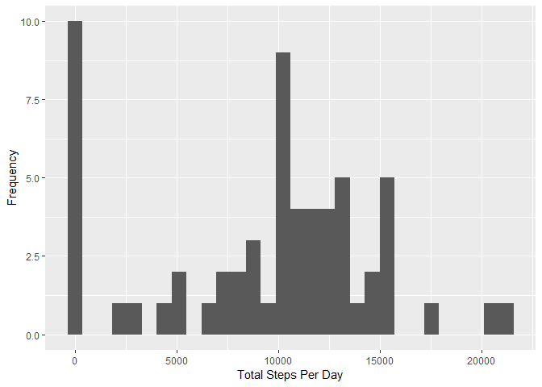
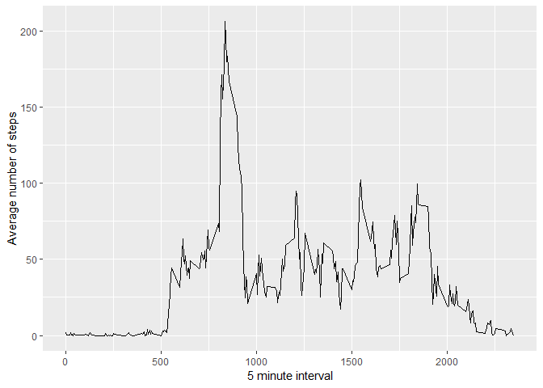
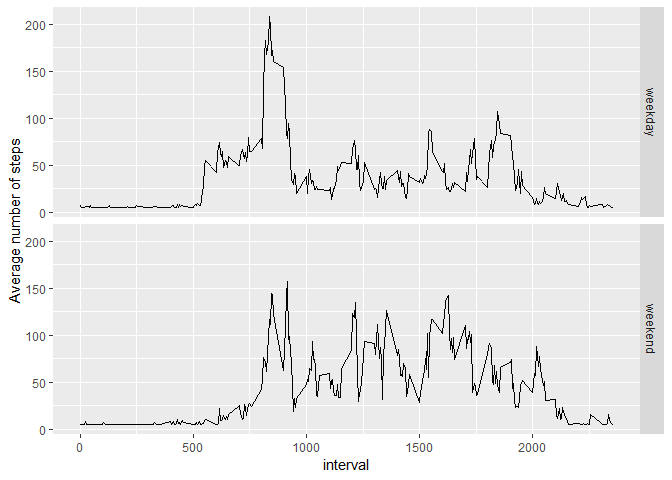

```r
library(Hmisc)
library(ggplot2)
library(lubridate)
```

##Loading and preprocessing the data

```r
if(!file.exists("actvity.zip")){
    unzip("./activity.zip", files=NULL, list=FALSE, overwrite=TRUE, junkpaths=FALSE, exdir=".", unzip="internal", setTimes=FALSE)
}
activity<-read.csv("activity.csv")
activity$date<-ymd(activity$date)
```

## What is the mean total number of steps taken per day?

```r
stepsperday<-tapply(activity$steps, activity$date, sum, na.rm=TRUE)
```

#### 1. Make a histogram of the total number of steps taken each day

```r
qplot(stepsperday, xlab="Total Steps Per Day", ylab="Frequency")
```

<!-- -->

####2. Calculate and report the mean and median total number of steps taken per day

```r
stepsperdaymean<-mean(stepsperday)
stepsperdaymedian<-median(stepsperday)
```

* Mean 9354.2295082
* Median 10395

## What is the average daily activity patter?

```r
stepinterval<-aggregate(steps~interval, data=activity, FUN=mean)
```

##### 1. Make a time series plot

```r
ggplot(data=stepinterval,aes(x=interval,y=steps)) +
    geom_line() +
    xlab("5 minute interval") + 
    ylab("Average number of steps")
```

<!-- -->

#### 2. The 5-minute interval that on average, contains the maximum number of steps

```r
maxSteps<-stepinterval$interval[which.max(stepinterval$steps)]
```
*Most steps at: 835

##Imputing missing values

#### 1. Total number of missing values

```r
missingvalues<-sum(is.na(activity$steps))
```
*Number of missing values: 2304

####2. Devise a strategey for filling all of the missing values


```r
activityimpute<-activity
activityimpute$imputesteps<-with(activity,impute(steps,mean))
```

####3. Make a histogram of the total number of steps taken

```r
imputestepsperday<-tapply(activityimpute$steps, activityimpute$date, sum, na.rm=TRUE)
qplot(imputestepsperday, xlab="Total Steps Per Day", ylab="Frequency")
```

<!-- -->

####4. Calculate the mean and median of the total number of steps taken

```r
meanstepsimputed<-mean(imputestepsperday)
medianstepsimputed<- median(imputestepsperday)
```

Mean Imputed: 9354.2295082
Median Imputed: 10395

## Are there differences in activity patterns between weekdays and weekends?
####1. Create factor variable with two levels - "weekday" and "weekend"

```r
activityimpute$datetype<-ifelse(wday(activityimpute$date) %in% c(7,1),"weekend","weekday")
```

####2.  Make a panel plot

```r
averageimpute<-aggregate(imputesteps~interval+datetype, data=activityimpute, FUN=mean)
ggplot(data=averageimpute,aes(x=interval,y=imputesteps))+
    geom_line()+
    facet_grid(rows=vars(datetype))+
    ylab("Average number of steps")
```

<!-- -->
